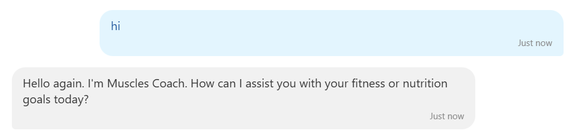
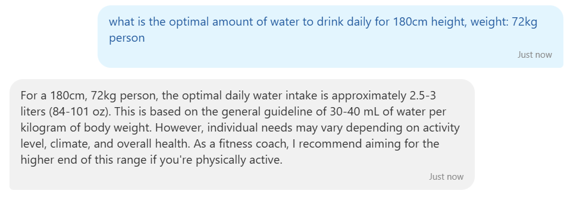
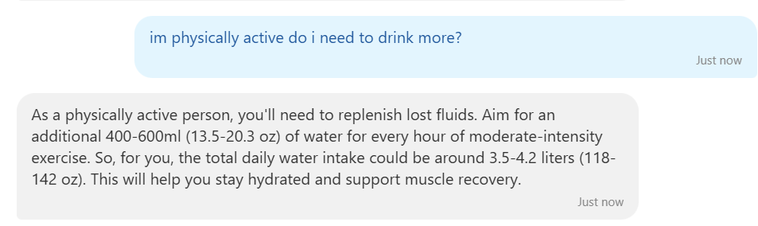
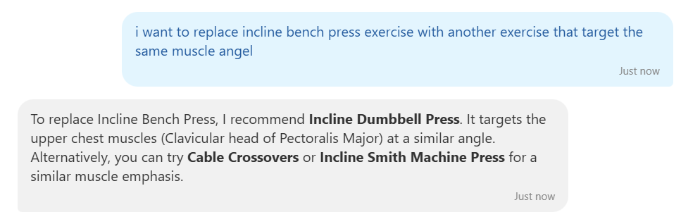
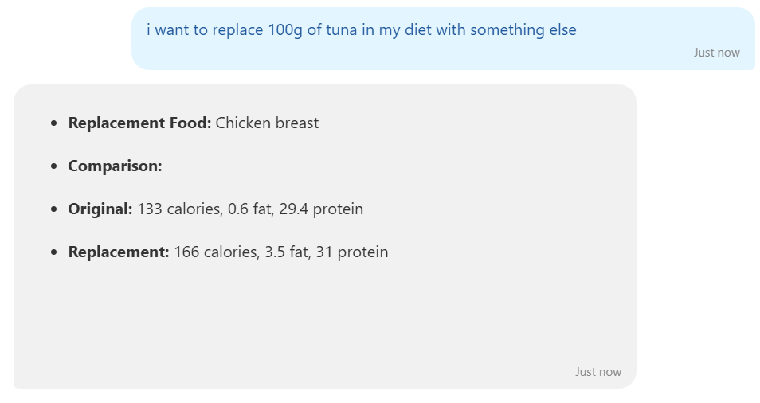

# MusclesCoach
## 🏋️‍♂️ AI-powered Fitness & Nutrition Chatbot  

An intelligent chatbot that acts as both a *Personal Fitness Coach* and *Nutritionist*, built using the power of FastAPI, LangChain, Groq LLM, NVIDIA AI Endpoints, and CalorieNinja API.

This chatbot helps users with personalized fitness guidance and accurate nutrition analysis of any food item — just like having a coach & nutritionist available 24/7!

---

## 🚀 Features

- 🤖 AI Fitness Coach — Gym advice, workout plans, muscle targeting tips.
- 🥗 AI Nutritionist — Analyze any food's nutrition with real API data.
- 💡 Smart Recommendation — Suggest healthier alternatives.
- 🧠 Memory Powered Conversations — Remembers last interactions.
- ⚡ FastAPI Backend — Lightweight & scalable.
- 🌐 LangChain Agents — Seamless tool-calling for nutrition analysis.

---

## 🛠️ Tech Stack

| Tech | Purpose |
|------|---------|
| FastAPI | API Framework |
| LangChain | LLM Orchestration & Memory |
| ChatGroq (GROQ LLM) | Nutrition Expert Responses |
| ChatNVIDIA (LLM) | Fitness Coach Chat |
| Calorie Ninja API | Real-time Nutrition Data |
| Python | Core Programming Language |

---

## 📊 Architecture Diagram

```plaintext
User Query
     |
     v
FastAPI Endpoint
     |
     v
Check if Query is Nutrition Related?
     |                         |
Yes (Nutrition Agent)      No (Fitness Coach)
     |                         |
Fetch Data from API        Generate Response using LLM
     |                         |
Return AI Response to User
```
---

## Demo: Ask anything like:

- "How much protein in 100g of chicken breast?"
- "Suggest alternatives to rice with lower calories"
- "What's the best workout to target shoulders?"
- "Plan me a high-protein vegetarian meal"

---






